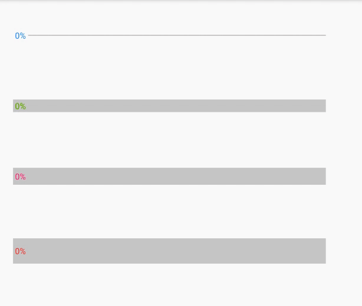
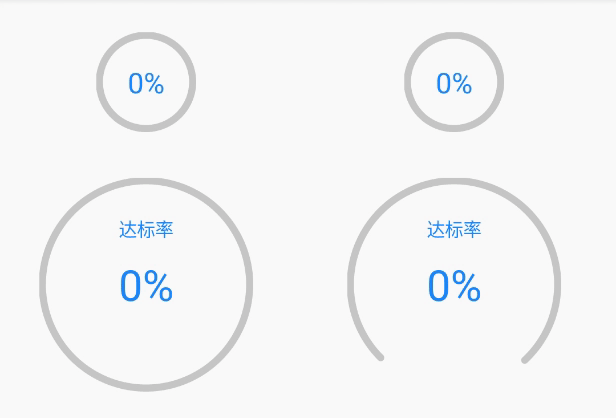
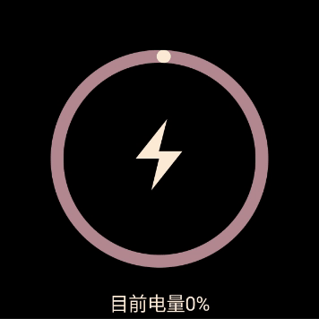
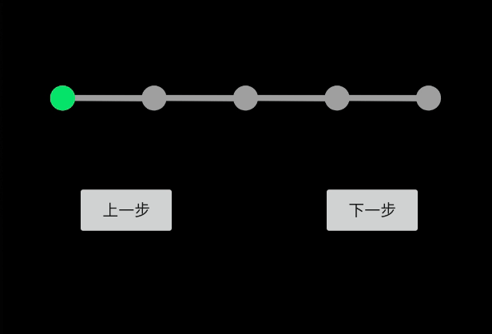

## ProgressBarPro

> ProgressBarPro集成了四种ProgressView，希望能满足您绝大部分ProgressView相关的需求😄

1. #### HorizontalProgressView（inspired from [NumberProgressBar](https://github.com/daimajia/NumberProgressBar)）

   * ##### 示图

     

   * ##### HorizontalProgressView自定义属性说明

     | 属性                   | 类型      | 默认值   | 说明           |
     | ---------------------- | --------- | -------- | -------------- |
     | progressMax            | integer   | 100      | 最大进度值     |
     | progressCurrent        | integer   | 0        | 当前进度值     |
     | progressBarHeight      | dimension | 1.5dp    | 进度条垂直高度 |
     | progressUnreachedColor | color     | #CCCCCC  | 进度条前景颜色 |
     | progressReachedColor   | color     | \#4291F1 | 进度条后景颜色 |
     | progressTextColor      | color     | \#4291F1 | 百分比字体颜色 |
     | progressTextSize       | dimension | 10sp     | 百分比字体大小 |
     | progressAnimTime       | integer   | 3000     | 进度条动画时间 |

     > 当传入的progressBarHeight值大于默认值时，进度条从线型变为条形

   * ##### 布局示例

     ```xml
     <com.joson.progress.view.horizontal.HorizontalProgressView
         android:id="@+id/horizontalProgress"
         android:layout_width="0dp"
         android:layout_height="wrap_content"
         app:progressBarHeight="15dp"
         app:progressCurrent="0"
         app:progressMax="100"
         app:progressBarHeight="20dp"
         app:progressUnreachedColor="#CCCCCC"
         app:progressReachedColor="#70A800"
         app:progressTextSize="10sp"
         app:progressTextColor="#70A800">
     
     </com.joson.progress.view.horizontal.HorizontalProgressView>
     ```

   * ##### 代码示例

     ```java
     horizontalProgressView.setAnimTime(2000); // 可以不设置
     horizontalProgressView.setProgress(80); // 必须设置
     ```

2. #### CircleProgressView

   * ##### 示图

     

   * ##### CircleProgressView自定义属性说明

     | 属性                      | 类型      | 默认值                  | 说明                      |
     | ------------------------- | --------- | ----------------------- | ------------------------- |
     | progressMax               | integer   | 100                     | 最大进度值                |
     | progressMode              | enum      | SEMI_CIRCLE (270度圆环) | 圆环进度条模式            |
     | progressUnit              | string    | 无                      | 进度条单位                |
     | progressStrokeWidth       | dimension | 5dp                     | 圆环宽度                  |
     | progressValueTextSize     | dimension | 10sp                    | 值的字体大小              |
     | textOffsetPercentInRadius | float     | 0.44                    | 占半径的百分比            |
     | progressHintTextSize      | dimension | 20sp                    | 提示字体大小              |
     | progressAnimTime          | integer   | 1000                    | 进度条动画时间            |
     | progressArcColors         | color     | 0                       | 渐变色数组（长度不超过3） |
     | progressUnreachedColor    | color     | #CCCCCC                 | 进度条前景颜色            |
     | progressReachedColor      | color     | \#4291F1                | 进度条后景颜色            |
     | progressValueTextColor    | color     | \#4291F1                | 值的字体颜色              |
     | progressHint              | string    | 无                      | 提示内容                  |

     > 当你没有设置progressArcColors时，默认不是渐变色，progressHint如果没有设置，那么不会显示任何提示内容，progressUnit同样。

   * ##### 布局示例

     ```xml
     <com.joson.progress.view.circle.CircleProgressView
         android:id="@+id/circleProgress3"
         android:layout_width="wrap_content"
         android:layout_height="wrap_content"
         app:progressArcColors="@array/gradient_arc_color"
         app:progressHint="达标率"
         app:progressHintTextSize="13sp"
         app:progressMax="100"
         app:progressMode="semiCircle"
         app:progressStrokeWidth="5dp"
         app:progressUnit="%"
         app:progressAnimTime = "2000"
         app:progressValueTextSize="30sp"
         app:textOffsetPercentInRadius="0.55">
     
     </com.joson.progress.view.circle.CircleProgressView>
     ```

   * ##### 代码示例

     ```java
     circleProgressView.setAnimTime(3000); // 可以不设置
     circleProgressView.setProgress(90); // 必须设置
     ```

3. #### ChargeProgressView（苹果设备无线充电）

   * ##### 示图

     

   * ##### ChargeProgressView自定义属性说明

     | 属性                   | 类型      | 默认值           | 说明                   |
     | ---------------------- | --------- | ---------------- | ---------------------- |
     | progressMax            | integer   | 100              | 最大进度值             |
     | progressHint           | string    | 空               | 下方提示内容           |
     | progressStrokeWidth    | dimension | 5dp              | 圆环宽度               |
     | progressUnit           | string    | 空               | 进度条单位             |
     | progressValueTextSize  | dimension | 10sp             | 提示内容和值的字体大小 |
     | progressAnimTime       | integer   | 1000             | 进度条动画时间         |
     | progressUnreachedColor | color     | #B4949A          | 进度条前景颜色         |
     | progressReachedColor   | color     | #FBEEDC、#6AE382 | 进度条后景颜色         |
     | progressValueTextColor | color     | #FBEEDC          | 提示内容和值的字体大小 |

     > 至于为什么progressReachedColor默认值有两个，当电量低于20%时为#FBEEDC，高于20%以后则为#6AE382。

   * ##### 布局示例

     ```xml
     <com.joson.progress.view.circle.ChargeProgressView
         android:id="@+id/chargeProgressView"
         android:layout_width="250dp"
         android:layout_height="250dp"
         android:layout_marginTop="32dp"
         android:background="@color/black"
         app:layout_constraintEnd_toEndOf="parent"
         app:layout_constraintStart_toStartOf="parent"
         app:layout_constraintTop_toBottomOf="@+id/circleProgress2"
         app:progressMax="100"
         app:progressHint = "目前电量"
         app:progressStrokeWidth="10dp"
         app:progressUnit="%"
         app:progressValueTextSize="15sp"
         app:progressAnimTime = "3000">
     
     </com.joson.progress.view.circle.ChargeProgressView>
     ```

   * ##### 代码示例

     ```java
     chargeProgressView.setAnimTime(500); // 当设置时间大于0时才有效
     chargeProgressView.setProgress(0);
     ```

4. #### NodeProgressView

   * ##### 示图

     

   * ##### NodeProgressView自定义属性说明

     | 属性                | 类型      | 默认值 | 说明           |
     | ------------------- | --------- | ------ | -------------- |
     | progressStage       | integer   | 3      | 总节点数       |
     | progressRadius      | dimension | 10dp   | 圆节点半径     |
     | progressStrokeWidth | dimension | 1dp    | 圆节点外环宽度 |

     > 除了stage，目前暂不推荐修改其它数据

   * ##### 布局示例

     ```xml
     <com.joson.progress.view.node.NodeProgressView
         android:id="@+id/nodeProgressView"
         android:layout_width="wrap_content"
         android:layout_height="wrap_content">
     </com.joson.progress.view.node.NodeProgressView>
     ```

   * ##### 代码示例

     ```java
     // 自行设计前进和回退触发事件
     lastButton.setOnClickListener(new View.OnClickListener() {
         @Override
         public void onClick(View v) {
             nodeProgressView.backStage();
         }
     });
     
     nextButton.setOnClickListener(new View.OnClickListener() {
         @Override
         public void onClick(View v) {
             nodeProgressView.addStage();
         }
     });
     ```
